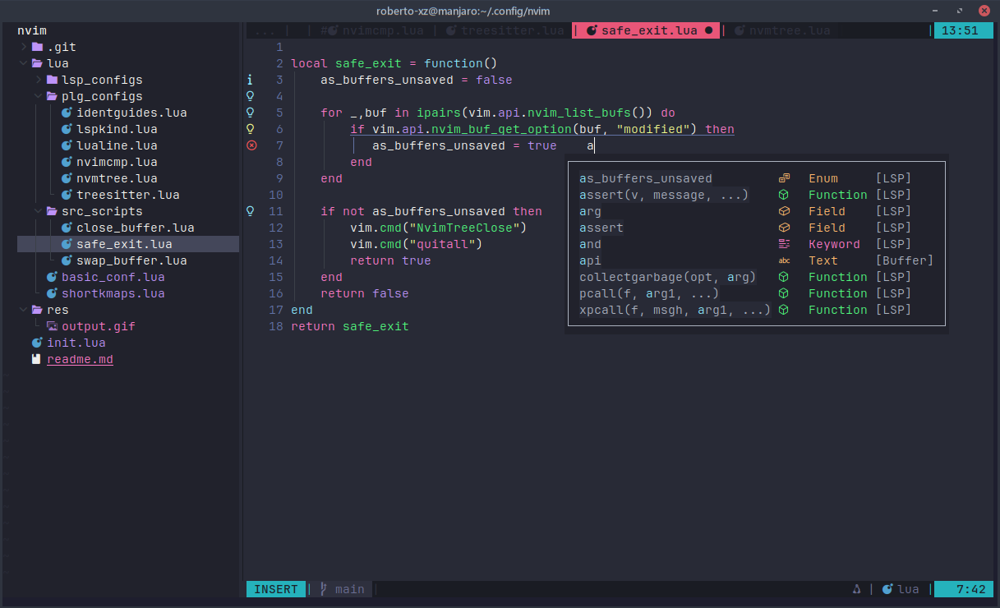

# MNeovim Configs

Este repositório contém as configurações personalizadas do Neovim que uso para manter minha IDE sempre à mão, independentemente do ambiente. Ele foi criado com o objetivo de preservar meu fluxo de trabalho e facilitar a instalação em novos sistemas.



## Objetivos
  - Disponibilizar uma IDE pronta para desenvolvimento, com todas as configurações, atalhos e plugins que uso regularmente.
  - Garantir portabilidade e facilidade de configuração ao usar o Neovim em diferentes dispositivos.
  - Fornecer uma base sólida para desenvolvimento, com suporte para linguagens, LSP, navegação eficiente e edição rápida.

## Funcionalidades Principais
  - Atalhos Personalizados: Mapeamentos otimizados para navegação, edição e integração com LSP.
  - Gerenciamento de Plugins: Configuração de plugins para produtividade e funcionalidades adicionais.
  - Suporte LSP Integrado: Autocompletes, renomeação de símbolos e navegação de código com atalhos intuitivos.
  - Configuração do Gestor de Arquivos: Integração com o nvim-tree para navegação eficiente.
  - Estilo Consistente: Configurações de temas, cores e layout para uma experiência visual agradável.
  - Portabilidade: Scripts para fácil instalação e adaptação a novos sistemas.

---

## Dependências

Para usar este repositório corretamente, você precisará instalar as seguintes dependências no seu sistema:
  - Plug: Gerenciador de plugins do Vim/Neovim.
  - Node.js: Usado por diversos plugins, especialmente para o suporte LSP e Treesitter.
  - xclip: Necessário para integração com o clipboard no Linux.
  - GCC: Compilador necessário para instalar o Treesitter e outros plugins que dependem de código C.

Certifique-se de que estas dependências estão instaladas antes de usar as configurações.

---

## Shortcuts

### Navegação
- **Ctrl-Left/Right**: Navega pelos buffers abertos.
- **Ctrl-q**: fecha o buffer atual, focando no anterior.
- **Ctrl-b**: Retorna para o buffer anterior.
- **Ctrl-f**: Abre ou foca no gestor de arquivos (nvim-tree).
- **Ctrl-e**: Fecha o Neovim, mas não fecha se houver buffers não salvos.

### Shortcuts LSP
- **Ctrl-k**: Vai para a definição da função.
- **Ctrl-r**: Renomeia todas as ocorrências.
- **Ctrl-tab**: Mostra o autocomplete.
- **Enter**: Confirma uma sugestão.
- **Left/Right**: Cancela e fecha o popup.

### Edição
- **Ctrl-d**: Duplica uma linha.
- **Ctrl-x**: Exclui a linha atual.
- **Ctrl-z**: Desfaz a última alteração.
- **Ctrl-w**: Salvamento forçado.
- **Ctrl-Up**: Move a linha atual para cima.
- **Ctrl-Down**: Move a linha atual para baixo.
- **Ctrl-/**: Comenta a linha, ou a seleção

## Como Usar
Clone este repositório no seu sistema:
``` bash
  git clone https://github.com/roberto-xz/MNeovim-Configs.git ~/.config/nvim
```

Instale as dependências necessárias (ex.: gerenciadores de plugins, ferramentas LSP).
Abra o Neovim e os plugins serão instalados automaticamente (dependendo da configuração).


