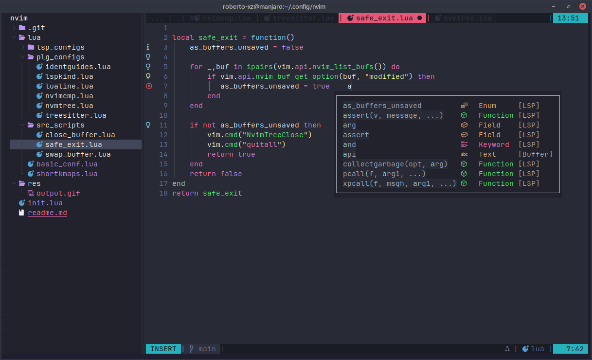

# MNeovim Configs

Configuração pessoal do Neovim focada em produtividade, portabilidade e baixo consumo de recursos. O objetivo deste projeto é disponibilizar um ambiente completo de desenvolvimento que possa ser replicado facilmente em qualquer máquina, mantendo os mesmos atalhos, ferramentas e fluxo de trabalho.



## Objetivos

* Disponibilizar um ambiente de desenvolvimento pronto para uso.
* Manter uma experiência consistente em diferentes sistemas.
* Centralizar configurações, plugins, atalhos e integrações.
* Utilizar ferramentas modernas do ecossistema Neovim sem depender de IDEs pesadas.
* Priorizar navegação rápida por teclado e integração com LSP.

---

## Funcionalidades

### Edição

* Sistema de atalhos baseado em `<leader>`.
* Duplicação e movimentação de linhas.
* Comentários rápidos.
* Fechamento seguro de buffers.
* Salvamento rápido.

### Navegação

* NvimTree para visualização da estrutura do projeto.
* Telescope para busca rápida de arquivos, buffers e conteúdo.
* Alternância rápida entre buffers.
* Navegação por definições e referências através do LSP.

### LSP

* Integração com a API nativa de LSP do Neovim.
* Suporte a TypeScript.
* Suporte a Lua.
* Renomeação de símbolos.
* Navegação para definições.
* Diagnósticos em tempo real.

### Interface

* Tema Dracula.
* Barra de status com Lualine.
* Guias de indentação com IBL.
* Compatibilidade com terminais sem Nerd Fonts.
* Interface minimalista e portátil.

---

## Plugins Utilizados

* vim-plug
* nvim-tree
* telescope.nvim
* plenary.nvim
* nvim-cmp
* cmp-buffer
* cmp-path
* cmp-cmdline
* cmp-nvim-lsp
* nvim-lspconfig
* lualine.nvim
* dracula.nvim
* indent-blankline.nvim (ibl)
* auto-session

---

## Dependências

### Obrigatórias

* Neovim >= 0.11
* Git
* Node.js
* npm
* ripgrep

### Linux

* xclip

### LSP

TypeScript:

```bash
npm install -g typescript typescript-language-server
```

Lua:

```bash
npm install -g lua-language-server
```

---

## Atalhos

### Gerais

| Atalho      | Ação                               |
| ----------- | ---------------------------------- |
| `<leader>w` | Salvar arquivo                     |
| `<leader>q` | Sair com verificação de alterações |
| `<leader>c` | Fechar buffer                      |
| `<leader>b` | Alternar para buffer anterior      |
| `<leader>t` | Alternar NvimTree                  |

### Buffers

| Atalho      | Ação            |
| ----------- | --------------- |
| `<leader>h` | Buffer anterior |
| `<leader>l` | Próximo buffer  |

### Edição

| Atalho      | Ação                   |
| ----------- | ---------------------- |
| `<leader>d` | Duplicar linha         |
| `<leader>x` | Excluir buffer         |
| `<leader>z` | Desfazer               |
| `<leader>j` | Mover linha para baixo |
| `<leader>k` | Mover linha para cima  |

### LSP

| Atalho | Ação              |
| ------ | ----------------- |
| `gd`   | Ir para definição |
| `F2`   | Renomear símbolo  |

### Folds

| Atalho      | Ação           |
| ----------- | -------------- |
| `<leader>[` | Recolher bloco |
| `<leader>]` | Expandir bloco |

### Telescope

| Atalho       | Ação                    |
| ------------ | ----------------------- |
| `<leader>ff` | Procurar arquivos       |
| `<leader>fg` | Buscar texto no projeto |
| `<leader>fb` | Listar buffers          |
| `<leader>fr` | Arquivos recentes       |
| `<leader>fs` | Sessões salvas          |

---

## Instalação

Clone o repositório:

```bash
git clone https://github.com/roberto-xz/MNeovim-Configs.git ~/.config/nvim
```

Abra o Neovim:

```bash
nvim
```

Instale os plugins:

```vim
:PlugInstall
```

Reinicie o Neovim após a instalação.

---

## Filosofia

Esta configuração busca equilibrar simplicidade e produtividade. A ideia não é transformar o Neovim em uma IDE gigantesca, mas fornecer ferramentas suficientes para desenvolvimento moderno, mantendo inicialização rápida, baixo consumo de recursos e total controle do ambiente.
